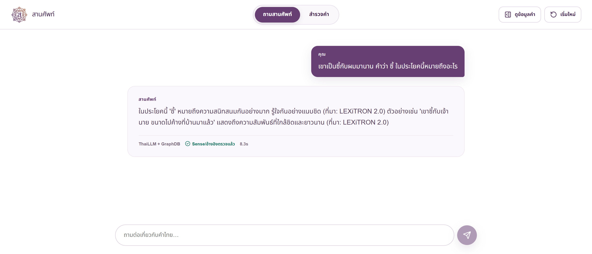
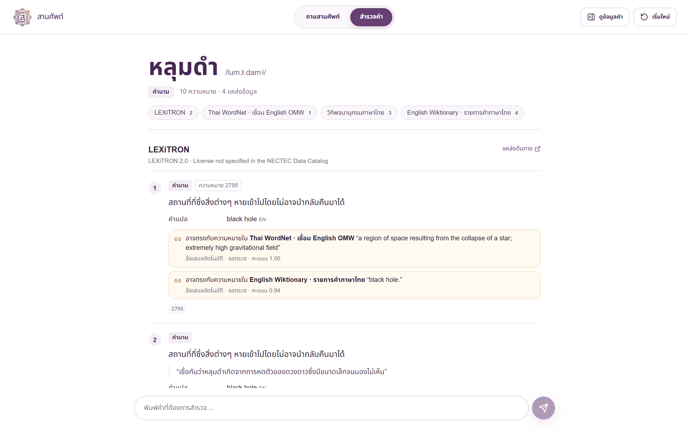

# SarnSap (สานศัพท์)

[](https://github.com/anupat2046/sarnsapt-open/actions/workflows/tests.yml)

A question answering system for Thai words that answers from several dictionaries at once. Every record keeps its own source and edition in a knowledge graph, and an answer may only cite evidence the backend has verified — not the model's memory.

[ภาษาไทย](README.md) · [architecture](docs/ARCHITECTURE.md) · [benchmark](docs/BENCHMARK.md)



## Does the graph make the same model answer better?

One model (`Pathumma-ThaiLLM-qwen3-8b`), three arms that differ only in what they are given. 60 words sampled from the graph in strata, answers judged blind.

| word group | ThaiLLM alone | ThaiLLM + flat definitions | full system |
|---|---|---|---|
| dialect words — matches the reference | **0%** | 91% | **92%** |
| technical terms — matches the reference | 33% | 100% | **100%** |
| made-up words — refused to invent a meaning | 92% | 100% | **100%** |
| cited a source that really carries the word | 0% | 0% | **100%** |

Dialect and technical vocabulary is where the model cannot know the answer on its own. Asked alone it matched no reference definition at all, and on rare words 20% of its answers contradicted the real definition without saying it was unsure — the failure a user cannot see. Method and caveats: [docs/BENCHMARK.md](docs/BENCHMARK.md).

## What it does

- **Answers questions written as sentences.** The model first reads the question (which word, what is asked, is there context), the backend retrieves that word from the graph, and the second call must answer under the intent the analysis derived. A word the graph does not have is reported as not found instead of being given an invented meaning.
- **Dictionary explore mode.** One word returns every sense grouped by source and edition, with pronunciation, examples, translations, relations, and the cross-source links still awaiting review.
- **Verifiable answers.** Each answer opens the relation graph, the evidence behind it, and every sense the system considered. When the provider is down the answer comes from the graph and says so.



## What is in the graph

Measured from the developer's local GraphDB at the time of writing:

- **13 datasets** in separate named graphs per source and edition · **272,523 senses** · **17.2M triples**
- **201,236 cross-source sense links**, all pending review — a proposal, not a claim
- Sources include Thai WordNet (linked to English OMW), Thai and English Wiktionary, LEXiTRON, Royal Institute dictionary editions, technical glossaries and dialect word lists

**The data files are not in this repository.** They are git-ignored and each source carries its own terms. What ships here is the ingestion code, the mapping schema, and synthetic sample data.

## Running it

Requires Docker Desktop, Python 3.13, PowerShell, and your own GraphDB 11.5 Free license at `secrets/graphdb.license`.

```powershell
Copy-Item .env.example .env
docker compose up -d
./scripts/init-graphdb.ps1
docker compose --profile frontend up -d --build
```

The UI is at `http://localhost:3000`. This works out of the box with the synthetic sample data, which is enough to see the whole pipeline; the real datasets have to be obtained separately and imported with the scripts in `scripts/`. Without an LLM key the system selects senses heuristically from graph evidence and says so.

## Stack

FastAPI · GraphDB 11.5 (SPARQL, ontolex/lemon, SKOS, PROV) · Next.js · Cytoscape.js · Docker Compose · ThaiLLM for sense selection and answer writing, with dependency-free Thai word segmentation built against the graph's own lemma list.

## License

Code under [Apache License 2.0](LICENSE). **Data is licensed separately from the code:** no external or organizer dataset is included here, and having ingestion code does not grant any right to redistribute or commercialize that data. Sample data in `examples/` and `data/sample/` is synthetic. Screenshots show open-licensed sources only. See [docs/DATA_POLICY.md](docs/DATA_POLICY.md).
