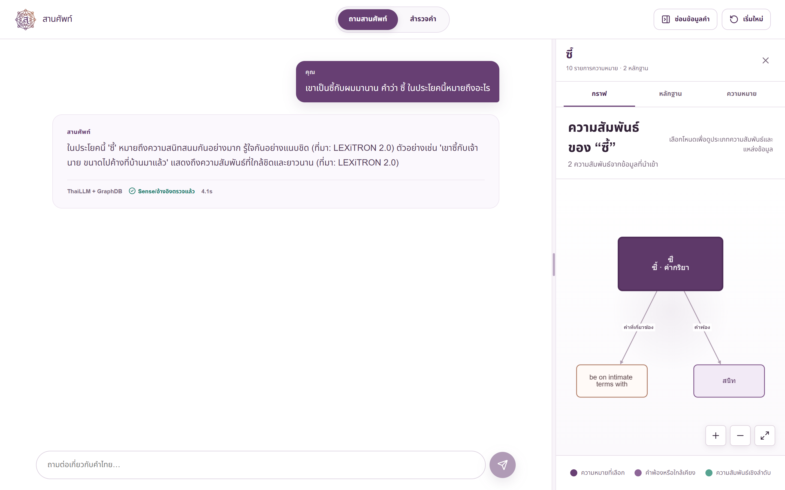

# สานศัพท์ (SarnSap)

[](https://github.com/anupat2046/sarnsapt-open/actions/workflows/tests.yml)

ระบบถามตอบเรื่องคำไทยที่ตอบจากพจนานุกรมหลายเล่มพร้อมกัน โดยเก็บทุกระเบียนและแหล่งที่มาแยกกันใน Knowledge Graph แล้วบังคับให้คำตอบอ้างอิงหลักฐานที่ตรวจสอบได้ — ไม่ใช่ความจำของโมเดล


## กราฟช่วยให้โมเดลเดิมตอบดีขึ้นแค่ไหน

วัดด้วยโมเดลเดียวกัน (`Pathumma-ThaiLLM-qwen3-8b`) ต่างกันแค่ข้อมูลที่ได้รับ สุ่มคำจากกราฟแบ่งเป็นกลุ่ม 60 คำ ให้ผู้ตรวจอ่านคำตอบโดยไม่เห็นว่าคำตอบไหนมาจากแขนใด

| กลุ่มคำ | ThaiLLM เปล่า | ThaiLLM + รายการนิยาม | สานศัพท์ (ระบบเต็ม) |
|---|---|---|---|
| ภาษาถิ่น — ตอบตรงนิยาม | **0%** | 91% | **92%** |
| ศัพท์เฉพาะสาขา — ตอบตรงนิยาม | 33% | 100% | **100%** |
| คำปลอม — ปฏิเสธไม่แต่งความหมาย | 92% | 100% | **100%** |
| อ้างแหล่งที่ตรวจสอบได้ | 0% | 0% | **100%** |

คำภาษาถิ่นและศัพท์เฉพาะสาขาคือจุดที่โมเดลไม่มีทางรู้เอง — ถามเปล่าแล้วตอบตรงนิยาม 0% และในกลุ่มคำหายากมี 20% ที่เดาผิดแบบขัดกับนิยามจริงโดยไม่บอกว่าไม่รู้ ซึ่งเป็นความเสียหายที่ผู้ใช้มองไม่เห็น

วิธีวัด ข้อจำกัด และตัวเลขเต็มอยู่ใน [แบบทดสอบ](docs/BENCHMARK.md)

## ความสามารถ

**ถามเป็นประโยคได้** — "เขาเป็นซี้กับผมมานาน คำว่า ซี้ ในประโยคนี้หมายถึงอะไร" ระบบเลือกความหมายที่เข้ากับบริบทจาก 10 ความหมายที่มี แล้วบอกว่าเอามาจากแหล่งไหน ถ้าไม่พบคำในกราฟจะบอกว่าไม่พบ ไม่แต่งความหมายให้

**สำรวจคำแบบพจนานุกรม** — พิมพ์คำเดียว เห็นทุกความหมายเรียงตามแหล่งและฉบับ พร้อมคำอ่าน ตัวอย่าง คำแปล คำสัมพันธ์ และข้อเสนอเชื่อมความหมายข้ามแหล่งที่ยังรอตรวจ


**ตรวจสอบคำตอบได้** — ทุกคำตอบเปิดดูกราฟความสัมพันธ์ หลักฐานรายข้อ และความหมายทั้งหมดที่ระบบพิจารณาได้ ถ้าโมเดลล่มระบบจะตอบจากกราฟและบอกตามตรงว่าคำตอบนั้นไม่ได้มาจากโมเดล



## ข้อมูลในกราฟ

ที่รันอยู่ในเครื่องผู้พัฒนาขณะเขียนเอกสารนี้ (ตัวเลขจาก GraphDB โดยตรง)

- **13 ชุดข้อมูล** แยก named graph ตามแหล่งและฉบับ · **272,523 ความหมาย** · **17.2 ล้าน triple**
- **201,236 ข้อเสนอเชื่อมความหมายข้ามแหล่ง** สถานะรอตรวจ ไม่ใช่คำยืนยัน
- แหล่งหลัก: Thai WordNet (เชื่อม English OMW), วิกิพจนานุกรมไทย, English Wiktionary (รายการคำไทย), LEXiTRON, พจนานุกรมราชบัณฑิตยสถาน ฉบับต่าง ๆ, อภิธานศัพท์เฉพาะสาขา และรายการคำภาษาถิ่น

**ไฟล์ข้อมูลไม่ได้อยู่ใน repo นี้** ทุกชุดถูก Git ignore และแต่ละแหล่งมีเงื่อนไขสิทธิ์ของตัวเอง สิ่งที่ repo มีคือโค้ดนำเข้าข้อมูล mapping schema และข้อมูลสังเคราะห์สำหรับทดลอง

## เริ่มใช้งานในเครื่อง (Windows / PowerShell)

ต้องมี Docker Desktop, Python 3.13, PowerShell และ GraphDB 11.5 Free license ของตนเอง วาง license ที่ `secrets/graphdb.license` (โฟลเดอร์นี้ถูก Git ignore)

```powershell
Copy-Item .env.example .env
docker compose up -d
./scripts/init-graphdb.ps1
docker compose --profile frontend up -d --build
```

เปิดหน้าเว็บที่ `http://localhost:3000` และ GraphDB Workbench ที่ `http://localhost:7200`

**คนอื่นรันได้แค่ไหน:** คำสั่งข้างบนใช้ได้ทันทีกับข้อมูลสังเคราะห์ `data/sample/thailex-sample.ttl` ซึ่งเพียงพอให้เห็นการทำงานของทั้งระบบ ส่วนชุดข้อมูลจริงทั้ง 13 ชุดต้องขอสิทธิ์และดาวน์โหลดเอง แล้วนำเข้าด้วยสคริปต์ในหัวข้อถัดไป หากยังไม่ตั้งค่า API ของ LLM ระบบจะใช้ตัวเลือกแบบ heuristic ตามหลักฐานในกราฟ ไม่ได้อ้างว่าเรียก LLM

หากต้องการใช้ ThaiLLM ให้ใส่ `THAILLM_API_KEY` ใน `.env` และตั้ง `THAILEX_SELECTOR_MODE=thaillm` ด้วยตัวเอง ห้าม commit `.env` หรือ key การเปิดโหมดนี้จะส่งคำถาม ประวัติสนทนา และข้อความหลักฐานบางส่วนจากชุดข้อมูล local ไปยัง API ภายนอก จึงต้องตรวจสิทธิ์และความเหมาะสมของข้อมูลก่อน

หยุดระบบด้วย `./scripts/stop.ps1` โดยไม่ลบ Docker volume

## ระบบตอบคำถามอย่างไร

1. **อ่านคำถามก่อน** — โมเดลตอบสองเรื่องง่าย ๆ ว่าผู้ใช้ถามถึงคำไหน ถามอะไร และมีประโยคบริบทหรือไม่ แทนการเดาด้วยกฎรูปประโยคภาษาไทย
2. **ค้นกราฟ** — แยกคำจากประโยคด้วยรายการคำที่มีจริงในกราฟ แล้วดึงทุกความหมายของคำนั้นพร้อมหลักฐาน จัดอันดับตามความเข้ากันกับบริบทในคำถาม
3. **เลือกและเขียนคำตอบ** — โมเดลเลือกความหมายและเขียนคำตอบภายใต้เจตนาที่วิเคราะห์ไว้ Backend ตรวจว่าความหมายและรหัสหลักฐานที่อ้างมีอยู่จริงก่อนแสดงผล
4. **ล้มแล้วบอก** — ThaiLLM มีช่วงที่ขัดข้อง ระบบจะ retry สั้น ๆ พักการเรียกชั่วคราว แล้วตอบจากกราฟพร้อมระบุว่าคำตอบไม่ได้มาจากโมเดล สถานะอยู่ใน `answer_mode` และ `fallback_reason` ของ API

การตรวจรหัสหลักฐานยืนยันว่าคำตอบอ้างของที่มีจริง ไม่ได้ยืนยันว่าข้อความอิสระของโมเดลถูกต้องทุกคำ รายละเอียดใน [สถาปัตยกรรม](docs/ARCHITECTURE.md)

## เพิ่มชุดข้อมูลจากเครื่อง

รองรับไฟล์ `CSV`, `JSON`, `JSONL`, `XML` ผ่าน mapping ของแต่ละชุดข้อมูล โครงสร้างตัวอย่างอยู่ใน `examples/` และ schema อยู่ใน `schemas/organizer-mapping.schema.json` ไฟล์จริงกับ mapping ที่มีรายละเอียดแหล่งข้อมูลควรเก็บใน `data/local/` ซึ่ง Git ignore

```powershell
./scripts/ingest-organizer.ps1 -InputPath ./examples/sample-dictionary.csv -MappingPath ./examples/sample-dictionary.mapping.json
```

หากต้องการลองจับคู่ข้ามแหล่งแบบไม่ใช้ข้อมูลจริง ให้นำเข้าชุดสังเคราะห์อีกชุดด้วย:

```powershell
./scripts/ingest-organizer.ps1 -InputPath ./examples/sample-glossary.csv -MappingPath ./examples/sample-glossary.mapping.json
Invoke-RestMethod 'http://localhost:8000/api/alignments?lemma=ดาว'
```

ตัวอย่างนี้ควรได้ข้อเสนอ “ดาว” ความหมายวัตถุบนท้องฟ้า 1 คู่ในสถานะ `pending`; ความหมายเครื่องหมายตกแต่งไม่ควรถูกเชื่อม ทั้งสองไฟล์ใน `examples/` เป็นข้อมูลสังเคราะห์เท่านั้น

สคริปต์ทำ audit → normalize → validate → RDF → import เข้า named graph ตาม `source.id` และ `edition_id` แล้วสร้างข้อเสนอเชื่อมความหมายข้ามแหล่งโดยอัตโนมัติสำหรับคำไทยที่มีหลักฐานเทียบกันได้ ข้อเสนอนี้ใช้เส้น `possiblySameSense` และมีสถานะ “รอตรวจ” ไม่ใช่คำยืนยันว่าเป็นความหมายเดียวกัน ระบบไม่เปลี่ยนคะแนนสูงให้เป็น `exactMatch` เอง และไม่เขียนทับผลตรวจของมนุษย์ หากไม่ต้องการรันการจับคู่อัตโนมัติในรอบนั้นให้ใส่ `-SkipAutoAlignment`

หาก graph เดิมมีข้อมูลแล้ว สคริปต์จะหยุดโดยไม่ลบข้อมูล หากตั้งใจแทนที่ให้ใช้ `-ReplaceExisting` ซึ่งจะสำรอง graph เดิมใน `data/rdf/backup/` ก่อนนำเข้า ไฟล์นั้นก็ถูก Git ignore

ไฟล์ `XLSX` และ `DOCX` ของผู้จัดต้องแปลงเป็น CSV ก่อนด้วย `prepare-organizer` ซึ่งมี profile แยกตามฉบับ ส่วนไฟล์ `.doc` รุ่นเก่าและ PDF ยังไม่รองรับ ต้องแปลงเองก่อน

อ่านขั้นตอนและข้อจำกัดเพิ่มเติมใน [คู่มือนำเข้าข้อมูล](docs/LOCAL_DATASETS.md)

## ทดสอบ

```powershell
$env:PYTHONPATH='src;backend'
python -m unittest discover -s tests -q
python -m unittest discover -s backend/tests -q
./scripts/test-frontend.ps1
```

ชุดทดสอบสดของ `/api/ask` และแบบทดสอบเทียบว่ากราฟช่วยให้โมเดลเดิมตอบดีขึ้นแค่ไหน (ต้องเปิดระบบและตั้ง `THAILLM_API_KEY` ก่อน)

```powershell
python scripts/eval-ask.py
python scripts/bench-grounded.py --per-stratum 12 --judge
```

## โครงสร้าง

- `frontend/` — Next.js UI และกราฟ Cytoscape.js
- `backend/` — FastAPI, การค้น SPARQL, แยกคำไทย, เลือกความหมาย, ตรวจหลักฐาน
- `src/thailex_ingestion/` — adapters, การแปลงไฟล์ผู้จัด, การสร้าง RDF, การจับคู่ความหมายข้ามแหล่ง
- `ontology/`, `schemas/` — แบบจำลองและ schema
- `examples/` — ข้อมูลสังเคราะห์สำหรับทดลอง
- `scripts/` — เริ่มระบบ นำเข้า ตรวจผล และวัดผล

## สิทธิ์การใช้งาน

โค้ดในโปรเจกต์นี้เผยแพร่ภายใต้ [Apache License 2.0](LICENSE) ส่วน **ข้อมูลเป็นคนละสิทธิ์กับโค้ด** ไฟล์ชุดข้อมูลจากแหล่งภายนอกและจากผู้จัดงานไม่ได้อยู่ใน repo นี้ (ถูก Git ignore) การมีโค้ดที่นำเข้าข้อมูลได้ไม่ได้แปลว่ามีสิทธิ์แจกจ่ายหรือใช้ข้อมูลนั้นเชิงพาณิชย์ ต้องตรวจ license ของแต่ละแหล่งเอง ข้อมูลตัวอย่างใน `examples/` และ `data/sample/` เป็นข้อมูลสังเคราะห์ที่เขียนขึ้นเองเพื่อทดสอบเท่านั้น ภาพหน้าจอในเอกสารนี้แสดงเฉพาะข้อมูลจากแหล่งเปิด ไม่ได้แสดงนิยามจากชุดข้อมูลของผู้จัด

repo นี้เป็น **โปรเจกต์ใหม่ที่แยกจากงาน Hackathon** ไม่มีประวัติ Git ของงานแข่ง ไม่มีไฟล์ข้อมูลจากผู้จัด ไม่มีไฟล์ลับหรือรายงานทีม สิทธิ์ในชื่อและตราสัญลักษณ์ “สานศัพท์” แยกต่างหากจาก license ของโค้ด ดูรายการตรวจใน [นโยบายข้อมูล](docs/DATA_POLICY.md)
